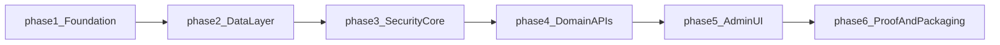

# Wellspring (Breakthrough take-home) — high-level plan

## Goals (~48 hours)

Ship a **credible, reviewable** submission: working **admin API** (Express + TypeScript + PostgreSQL) and **Next.js Admin Panel**, with the brief’s **non-negotiable quality bars** (tenant isolation at the data layer, idempotent CSV import, grep-friendly isolation test names, structured JSON logs with `tenant_id` and `request_id`, migrations-only schema, tenant-scoped time-limited S3 presigns), plus **all five mandatory deliverables** (public repo, `/ai-history`, `docs/CODE_SUMMARY.md`, `docs/ARCHITECTURE_REVIEW.md`, Loom URL in README).

## Repository strategy (**locked**)

- **Monorepo: yes** — one public GitHub repo with clear package boundaries:
  - `apps/api` — HTTP API, migrations, seed, integration tests.
  - `apps/web` — Next.js admin UI (calls API; env for API base URL).
- **Workspaces only for v1** — use **pnpm workspaces** (or npm/yarn workspaces if you prefer one lockfile you already use). Root orchestrates `dev`, `test`, `db:migrate`, `db:seed` via workspace filters, `concurrently`, or `pnpm -r` / `--filter` scripts.
- **Turborepo: intentionally deferred** — acceptable to add **after** the take-home once pipelines warrant caching. For this window it avoids extra config, cache, and pipeline debugging; it does **not** change how reviewers read your architecture.

**Recommendation:** Your instinct matches the tradeoff: **lock monorepo structure now**, skip Turbo until post-deadline or only if you finish early and want polish.

## Phased delivery (execution order after you approve)

| Phase                     | What you ship                                                                                                                                                                                                                                                         |
| ------------------------- | --------------------------------------------------------------------------------------------------------------------------------------------------------------------------------------------------------------------------------------------------------------------- |
| **1 — Foundation**        | Monorepo layout, `.env.example`, API and web dev servers, DB connectivity from API.                                                                                                                                                                                   |
| **2 — Data layer**        | Migrations-only schema (tenants/creators, programs, sessions with order + client import idempotency key, audit, password-reset storage); `db:seed` (2 creators × 3 programs × ~10 sessions each).                                                                     |
| **3 — Security core**     | Signup/login/JWT, password-reset **token model** (email delivery can be dev-stub per out-of-scope notes), tenant context propagated into **data access** (not only controllers), audit rows on admin writes, JSON logs with `tenant_id` + `request_id` on every line. |
| **4 — Domain APIs**       | Program/session CRUD, session reorder, CSV bulk import with row-level errors + idempotent client id, audit log read with filters, S3 presign endpoint scoped to tenant.                                                                                               |
| **5 — Admin UI**          | All required screens: auth, programs, sessions + drag-reorder, media upload via presign, CSV feedback UI, audit viewer with filters.                                                                                                                                  |
| **6 — Proof + packaging** | Tests proving cross-tenant rejection (names they can grep), README (setup/run/test/seed), Loom, `docs/*`, populate `/ai-history`, email submission.                                                                                                                   |

Detailed rubric, deliverable checklist, and out-of-scope cuts are in the sections below for reference while implementing.

---

## Day-0 bootstrap: what to create first (Cursor rules + skeleton files)

Use this as the **first implementation batch** once you explicitly leave plan-only mode and say you want execution. Order minimizes rework: contracts and guardrails before features.

### 1) Cursor rules (`.cursor/rules/*.mdc`)

Per Cursor project rules (`.cursor/rules/*.mdc` with YAML frontmatter: `description`, `globs`, `alwaysApply`):

| Suggested file          | Scope                           | What it should enforce                                                                                                                                                                                                                                                                                                                                                                                                                         |
| ----------------------- | ------------------------------- | ---------------------------------------------------------------------------------------------------------------------------------------------------------------------------------------------------------------------------------------------------------------------------------------------------------------------------------------------------------------------------------------------------------------------------------------------- |
| `wellspring-rubric.mdc` | `alwaysApply: true`             | Breakthrough non-negotiables: **tenant isolation in the data layer** (not only controllers), **migrations-only** schema, **structured JSON logs** with `tenant_id` + `request_id` on every line, **S3 presign** tenant-scoped + time-limited, **CSV idempotency** via client-provided ID, **audit** on admin writes, **≥3 tests** whose names include `rejects cross-tenant`, deliverable checklist (`/ai-history`, `docs/*`, Loom in README). |
| `apps-api.mdc`          | `globs: apps/api/**/*.ts`       | Express + TS style: thin routes, **tenant-scoped repositories/queries**, JWT claims → tenant context, no ad-hoc DDL.                                                                                                                                                                                                                                                                                                                           |
| `apps-web.mdc`          | `globs: apps/web/**/*.{ts,tsx}` | Next.js App Router, env-based API base URL, functional UI is fine, forms and error states for CSV validation feedback.                                                                                                                                                                                                                                                                                                                         |

### 2) Repo skeleton (create in this order)

1. **Root workspace** — `package.json` (workspace definitions), `pnpm-workspace.yaml` (or equivalent), root `.gitignore` (include `.env`, `node_modules`, Next/TS build dirs, OS junk).
2. **`README.md`** — Skeleton early; put a **placeholder line at the very top** for the **Loom URL** (replace after recording). Sections: prerequisites, setup, `dev` / `test` / `db:migrate` / `db:seed`, link to `docs/`.
3. **`AGENTS.md`** (root) — Short runbook: how to install, run `dev`, run tests, migrate, seed (not listed as a separate Breakthrough deliverable, but agreed for this repo so you and Cursor stay aligned).
4. **`.env.example`** — All required vars with safe dummy values (e.g. `DATABASE_URL`, JWT secret/issuer, `AWS_*` or LocalStack/MinIO vars, `WEB_ORIGIN`, `API_URL` for the web app). Keeps onboarding honest.
5. **`apps/api`** — Minimal runnable app: `package.json`, `tsconfig.json`, single health route, DB client module stub, later migrations folder (e.g. `migrations/` or tool-specific layout).
6. **`apps/web`** — Minimal Next.js app that starts and reads `NEXT_PUBLIC_API_URL` (or server-side `API_URL`) from env.
7. **`ai-history/README.md`** — Explains that raw AI exports go here with chronological names (`01-...md`); add **`ai-history/.gitkeep`** if you want the folder tracked before first export.
8. **`docs/CODE_SUMMARY.md`** — **Outline only** at start (section headers per module: `auth/`, `tenants/`, `programs/`, `sessions/`, `uploads/`, `audit/`, etc.); fill 3–6 sentences per module as you build (avoids invented content).
9. **`docs/ARCHITECTURE_REVIEW.md`** — **Outline only** at start; full prose near the end (see **“Purpose of `docs/*`”** below).

**Defer until after schema exists:** heavy `CODE_SUMMARY` / `ARCHITECTURE_REVIEW` prose, real chat exports in `/ai-history`, and the final Loom link.

### Purpose of `docs/CODE_SUMMARY.md` vs `docs/ARCHITECTURE_REVIEW.md`

These are **both submitted to Breakthrough**, but they serve **different readers and goals**:

| File                         | Primary audience                                                                                                      | Intent                                                                                                                                                                                                                                                                                                                                                                                                                                              |
| ---------------------------- | --------------------------------------------------------------------------------------------------------------------- | --------------------------------------------------------------------------------------------------------------------------------------------------------------------------------------------------------------------------------------------------------------------------------------------------------------------------------------------------------------------------------------------------------------------------------------------------- |
| **`docs/CODE_SUMMARY.md`**        | A **new engineer joining the team** (they say: “what a new hire would read on day 1”)                                 | **Module-by-module orientation**: what each area does, key design choices, how to extend it. Reads like **onboarding / internal map of the codebase** (this is your **architecture map**). |
| **`docs/ARCHITECTURE_REVIEW.md`** | **The hiring reviewers** (they call it the **“highest-signal artifact”** and say they **respect honest self-review**) | **Reflective essay (~1000 words)**: what you built vs **skipped and why**, tenant isolation strategy and **scale hypotheticals** (100 vs 10k creators), bulk import idempotency and **failure modes**, S3 security and **large-file evolution**, **what you are not confident in**, **what you would do with two more days**. For **reviewers to judge judgment**; complements Loom/code, does not replace the module map. |

So: **`ARCHITECTURE_REVIEW.md`** is not “only for you” — you write it **to the reviewers** about your architecture and tradeoffs. **`CODE_SUMMARY.md`** is closer to **project documentation for the next person in the repo** (still read by reviewers, but the tone and template are “explain the code,” not “interview me on my doubts”).

### Where “project architecture” is documented (yes, you do)

Breakthrough does **not** require a file literally named `ARCHITECTURE.md`, but **architecture is still documented**—across several artifacts:

| Artifact | Architecture role |
| -------- | ------------------- |
| **`docs/CODE_SUMMARY.md`** | **Structural / module-level architecture**: how `apps/api` and `apps/web` relate, main request/data flows, where tenant isolation is enforced, how to extend. This *is* your **project architecture map** in prose. |
| **`docs/ARCHITECTURE_REVIEW.md`** | **Rationale, tradeoffs, and scale story**: *why* the architecture looks that way, failure modes, honest gaps—complements the map; it should not contradict `CODE_SUMMARY` or the code. |
| **`README.md`** | **Operational view**: how to run, migrate, seed, configure env—how the system is assembled locally. |
| **Loom** | **Walk-through architecture**: schema + tenant isolation **in code** (explicitly requested). |
| **Migrations + layered code** | **Executable architecture**: schema and boundaries should match what the docs say. |

Optional: a single Mermaid diagram inside `CODE_SUMMARY` (or `docs/diagrams/`) if it helps the day-one reader—only if it adds clarity without duplicating the Loom.

### 4) What *not* to front-load

- Full auth UI polish, drag-and-drop polish, or production email — wire correctness first.
- Turborepo, shared `packages/*`, or elaborate CI — only if time remains after quality bars.

---

# Rubric reference — what the document is really asking for

## What they are optimizing for (meta)

This is **not** a speed-coding test. They explicitly frame 2026 engineering as **AI-augmented**: they will read chat logs, look for coherent architecture across AI-generated pieces, and reward **judgment** (what you accepted, rejected, fixed) over shipping “100% of generated slop.”

**Mandatory:** use AI tools throughout; submissions **without AI usage evidence** are not reviewed. That maps directly to deliverable **#2** (`/ai-history` — raw exports, chronological filenames, do not curate).

They also say they will **grep** for specific tenant-isolation test names, so naming and coverage are part of the contract.

---

## Product: Wellspring

A **multi-tenant CMS for wellness creators**:

- **Tenant = creator** — own branded space, own admin login.
- **Programs** — belong to a creator (e.g. course titles); **sessions** belong to programs.
- **Sessions** — audio or video; fields include title, duration, ordered position, instructor name, tags, media file URL.
- **Audit log** — every **admin write** by a creator: actor, action, target entity, timestamp.

---

## Backend expectations ([Node.js](https://nodejs.org/) + [Express](https://expressjs.com/) + [TypeScript](https://www.typescriptlang.org/) + [PostgreSQL](https://www.postgresql.org/))

Admin API (JWT auth for creators):

| Area        | Requirement                                                      |
| ----------- | ---------------------------------------------------------------- |
| Auth        | Signup, login, password reset                                    |
| Data        | CRUD programs and sessions                                       |
| Ordering    | Drag-reorder sessions within a program                           |
| CSV         | Bulk import with **row-level validation feedback**               |
| Idempotency | Same **client-provided ID** on retry must **not** duplicate rows |
| Media       | Pre-signed **S3** upload URL for session media                   |
| Audit       | View audit log with filters: **date range**, **action type**     |

---

## Admin UI ([Next.js](https://nextjs.org/))

“Functional UI” — Tailwind or plain HTML is fine. Required screens:

1. Creator signup / login
2. Program list, create, edit
3. Session list with **drag-reorder**
4. Session create/edit including **S3 pre-signed upload** flow
5. Bulk CSV upload with **which rows failed and why**
6. Audit log viewer with **date** and **action type** filters

---

## Non-negotiable quality bars (they say they will probe these)

1. **Tenant isolation at the data layer** — not only controller checks; they will try to **forge `tenant_id`** to read another creator’s data.
2. **Idempotent bulk imports** — duplicate client IDs must not double-write.
3. **Tests** — at least **three** tests with names like `rejects cross-tenant program access` (they grep for this pattern).
4. **Structured JSON logs** — `tenant_id` and `request_id` on **every** log line.
5. **Migrations** — schema via migration files, not ad-hoc SQL.
6. **S3** — pre-signed URLs **scoped**, **time-limited**, **tied to the requesting tenant**.

---

## Five required deliverables (missing any disqualifies)

1. **Public GitHub repo** — README (setup, run, test, seed), `.env.example`, scripts: `dev`, `test`, `db:migrate`, `db:seed`; seed: **2 creators**, **3 programs each**, **~10 sessions per program**. Email link to **[rutul@breakthroughapps.io](mailto:rutul@breakthroughapps.io)** with subject **Take-home submission — [Your Name]**.
2. `**/ai-history`** — full raw AI session exports, chronological naming.
3. `**docs/CODE_SUMMARY.md`** — module-by-module, 3–6 sentences each (what, key design, non-obvious usage).
4. `docs/ARCHITECTURE_REVIEW.md` — ~1000 words, honest self-review (built vs skipped, tenant strategy at 100 / 10k creators, bulk import + failure modes, S3 security + large files, uncertainty, "two more days").
5. **Loom 5–7 min** — demo, schema + tenant isolation in code, how you used AI, one thing different. **URL at top of README.** Submissions **without Loom** are not reviewed.

Timeline guidance in the doc: **~48 hours**; polish and scoping matter.

---

## Out of scope (explicit, implied, and pragmatic)

Use this section to avoid gold-plating and to **call out honest cuts** in `docs/ARCHITECTURE_REVIEW.md` (“what I skipped — and why”).

### Explicitly out of scope per the brief

- **Pixel-perfect or highly bespoke visual design** — they say they are **not** grading this; a **functional** admin UI (Tailwind or plain HTML) is enough.

### Implied out of scope (not listed in the requirements)

Reasonable to treat as **not required** unless you add them with a clear tradeoff story in the architecture review:

- **Public / end-user “branded creator space”** — creators and branding are part of the domain story, but the **deliverable surfaces** are the **Admin Panel** and **admin API**. A consumer-facing site, student app, or SEO marketing pages are not specified.
- **Native or secondary clients** — no mobile app, desktop app, or CLI requirement.
- **Social or enterprise SSO** — only **signup, login, password reset** for creators is in scope.
- **Billing, subscriptions, trials, or usage metering** — not mentioned.
- **Beyond-audit observability** — no requirement for metrics dashboards, distributed tracing, APM, or shipping logs to a vendor. **Structured JSON logs** with `tenant_id` and `request_id` are the bar.
- **Full media platform** — transcoding, thumbnails, adaptive streaming (HLS), watermarking, or **viewer**-side signed playback are not required. The **pre-signed upload** flow and storing a **media URL** on the session are. Large-file evolution belongs in the essay if not built.
- **Production operations** — HA Postgres, replicas, multi-region, Kubernetes, blue/green deploys, and enterprise secrets rotation are not asked for (good material for “at 10,000 creators” in the review doc).

### Pragmatic stubs (allowed if documented, not “fake done”)

- **Password reset email delivery** — production email (templates, deliverability, DNS) is not the graded product. A **correct reset-token model** plus **dev-friendly** delivery (logged link, local mail catcher, etc.) is usually fine if README and `ARCHITECTURE_REVIEW.md` state it plainly.
- **S3 in local dev** — **LocalStack**, **MinIO**, or mocks can be acceptable if **presign semantics** match what you would run in AWS (scoped key, expiry, tenant binding) and the review doc says how you would deploy for real.

### Still in scope (common misread)

- **“Branded space”** in the domain narrative does **not** obligate a separate public storefront; it mainly motivates **tenant isolation** and **per-creator admin data**.
- **Audit log** is **admin writes only** — you do not need to log every read or end-user activity unless you choose to (not required).

---

## Current workspace note

`[/Users/subhan/Work/wellspring-subhan-ahmed](/Users/subhan/Work/wellspring-subhan-ahmed)` currently contains only `.git` (no application code yet). Implementation is a **full stack greenfield** aligned to the rubric above.

---

## Optional later (not part of the 48h lock)

- **Turborepo** — add when you want task caching and clearer pipeline graphs; not required for reviewers to run `dev` / `test` / `db:`*.
- `**packages/shared`** — shared DTO types or zod schemas between API and web; only if it saves time vs duplicating small types.

