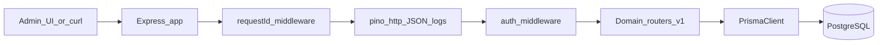
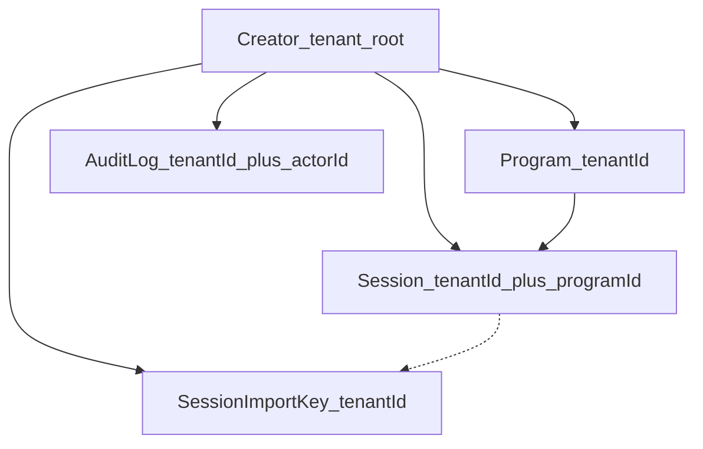

# Cursor agent session (Markdown export)

**Source:** `07-cursor-agent-transcript-28d7767b.jsonl` · **conversation id:** `28d7767b`

_This file is rendered from the JSONL transcript next to it: same turns, formatted for reading. The `.jsonl` is the authoritative raw export._

---

## Exchange 1

### User

<user_query>
Lets go through the docs, readme, and requirements to plan schema design and then add it to prisma.
</user_query>

---

## Exchange 2

### Assistant

Reviewing requirements, README, and existing Prisma setup to draft a schema plan.

[REDACTED]

**Tool:** `Read`

```json
{
  "path": "/Users/subhan/Work/wellspring-subhan-ahmed/docs/REQUIREMENTS.md"
}
```


**Tool:** `Glob`

```json
{
  "target_directory": "/Users/subhan/Work/wellspring-subhan-ahmed",
  "glob_pattern": "**/README*.md"
}
```


**Tool:** `Glob`

```json
{
  "target_directory": "/Users/subhan/Work/wellspring-subhan-ahmed",
  "glob_pattern": "**/schema.prisma"
}
```


**Tool:** `Read`

```json
{
  "path": "/Users/subhan/Work/wellspring-subhan-ahmed/docs/CODE_SUMMARY.md",
  "limit": 150
}
```

### Assistant

[REDACTED]

**Tool:** `Read`

```json
{
  "path": "/Users/subhan/Work/wellspring-subhan-ahmed/README.md"
}
```


**Tool:** `Read`

```json
{
  "path": "/Users/subhan/Work/wellspring-subhan-ahmed/backend/src/prisma/schema.prisma"
}
```


**Tool:** `Glob`

```json
{
  "target_directory": "/Users/subhan/Work/wellspring-subhan-ahmed/backend",
  "glob_pattern": "**/prisma/**"
}
```

### Assistant

[REDACTED]

**Tool:** `Read`

```json
{
  "path": "/Users/subhan/Work/wellspring-subhan-ahmed/docs/BACKLOG.md"
}
```


**Tool:** `Read`

```json
{
  "path": "/Users/subhan/Work/wellspring-subhan-ahmed/backend/src/prisma/migrations/20260512120000_init/migration.sql"
}
```


**Tool:** `Read`

```json
{
  "path": "/Users/subhan/Work/wellspring-subhan-ahmed/backend/package.json"
}
```


**Tool:** `Read`

```json
{
  "path": "/Users/subhan/Work/wellspring-subhan-ahmed/backend/src/prisma/seed.ts"
}
```

### Assistant

Checking ARCHITECTURE_REVIEW and backend rules for schema expectations:

[REDACTED]

**Tool:** `Read`

```json
{
  "path": "/Users/subhan/Work/wellspring-subhan-ahmed/docs/ARCHITECTURE_REVIEW.md",
  "limit": 80
}
```

### Assistant

Noting the Prisma schema and an initial migration already exist. Planning a requirements-to-schema mapping, gap analysis, and concrete Prisma/migration steps.

[REDACTED]

**Tool:** `CreatePlan`

```json
{
  "name": "Prisma schema alignment",
  "overview": "Map [docs/REQUIREMENTS.md](docs/REQUIREMENTS.md) and backlog items to the database: the repo already defines core models and an `init` migration under `backend/src/prisma/`. The plan validates that mapping, closes gaps (notably password reset persistence), tightens optional integrity constraints, and describes how to ship changes via Prisma Migrate only.",
  "plan": "# Prisma schema design from requirements\n\n## What the brief asks for (data-shaped)\n\nFrom [docs/REQUIREMENTS.md](docs/REQUIREMENTS.md) and [docs/BACKLOG.md](docs/BACKLOG.md):\n\n| Domain need | Data implication |\n|-------------|------------------|\n| Creators are tenants; admin login | Tenant root entity with credentials (`email`, `passwordHash`); stable `id` = JWT `tenantId` |\n| Programs per creator | `tenantId` on every program row; FK to tenant |\n| Sessions per program | Title, duration, ordered position, instructor, tags, media URL; belongs to program; **same `tenantId`** for repository-level isolation without trusting joins alone |\n| Audit log | Actor, action, target entity, timestamp; filter by date + action; `tenantId` for scoping |\n| Idempotent CSV import | Stable key: **tenant** + **client import id** + **client row id** (or equivalent) so retries do not duplicate |\n| Password reset (auth API) | Usually **persisted reset tokens** (hashed, expiry, optional `usedAt`) — not present in current schema |\n\nS3 presign and JWT payloads do **not** require extra tables beyond `Session.mediaUrl` unless you later add upload receipts or asset metadata (out of scope unless you choose to add them).\n\n## Current state (already in Prisma)\n\n[`backend/src/prisma/schema.prisma`](backend/src/prisma/schema.prisma) and migration [`backend/src/prisma/migrations/20260512120000_init/migration.sql`](backend/src/prisma/migrations/20260512120000_init/migration.sql) already implement:\n\n- **`Creator`** — tenant root; `programs`, `sessions`, `auditLogs` relations\n- **`Program`** — `tenantId` + FK to `Creator`, `@@index([tenantId])`\n- **`Session`** — required fields align with the brief (`durationSeconds`, `position`, `instructorName`, `tags` `String[]`, `mediaUrl`); `tenantId` + `programId` with cascade deletes; composite index `(programId, position)` for reorder lists\n- **`AuditLog`** — `tenantId`, `actorId`, `action`, `targetType`, `targetId`, `metadata` (JSON), `createdAt`; indexes for date-range and action filters\n- **`SessionImportKey`** — `@@unique([tenantId, clientImportId, clientRowId])` for idempotent imports; optional `sessionId` (no FK yet)\n\nScripts already point at this schema path: [`backend/package.json`](backend/package.json) (`--schema src/prisma/schema.prisma`).\n\n**Note:** [README.md](README.md), [docs/BACKLOG.md](docs/BACKLOG.md), and [`.cursor/rules/backend.mdc`](.cursor/rules/backend.mdc) mention `backend/prisma/`; the **authoritative** layout is `backend/src/prisma/`. When implementing, either update those doc references in a small follow-up or remember the real path to avoid confusion.\n\n## ER view (logical)\n\n```mermaid\nerDiagram\n  Creator ||--o{ Program : owns\n  Creator ||--o{ Session : scopes\n  Program ||--o{ Session : contains\n  Creator ||--o{ AuditLog : acts\n  SessionImportKey }o--o| Session : maps\n  Creator ||--o{ PasswordResetToken : proposed\n```\n\n## Recommended schema adjustments (before or right after “schema complete”)\n\nThese are **additive** migrations on top of the existing `init` migration (do not edit applied migration SQL in place).\n\n1. **`PasswordResetToken` (recommended — brief lists password reset)**  \n   - Fields: `id`, `creatorId` (FK `Creator`), `tokenHash` (unique), `expiresAt`, `usedAt` nullable, `createdAt`  \n   - Indexes: `creatorId`, `expiresAt` (cleanup jobs / lookups)  \n   - Keeps reset flow stateless at the HTTP layer but **stateful** in DB, which is standard for secure one-time tokens\n\n2. **Referential integrity (optional but low-cost)**  \n   - `SessionImportKey`: add FK `tenantId` → `Creator` and optional FK `sessionId` → `Session` (`onDelete: SetNull` if you want keys to survive session delete, or `Restrict` if you prefer strictness)  \n   - `AuditLog`: optional FK `tenantId` → `Creator` (today only `actorId` references `Creator`)\n\n3. **Reorder / concurrency (optional)**  \n   - `@@unique([programId, position])` on `Session` prevents duplicate positions within a program if the API ever mis-orders; batch reorder endpoints must still assign a consistent temporary strategy (e.g. two-phase position swap) — document the chosen algorithm in [`docs/ARCHITECTURE_REVIEW.md`](docs/ARCHITECTURE_REVIEW.md) when implemented\n\n4. **No change needed for**  \n   - Storing tags as `String[]` (fine for MVP)  \n   - `AuditLog.action` as `String` (filter by action type = equality / `IN` on indexed column)\n\n## What “add it to Prisma” means in this repo\n\n1. Edit [`backend/src/prisma/schema.prisma`](backend/src/prisma/schema.prisma) with the agreed models/relations/indexes.  \n2. From `backend/`, run **`pnpm db:migrate:dev --name <description>`** (or the equivalent `pnpm exec prisma migrate dev ...`) to generate a **new** folder under [`backend/src/prisma/migrations/`](backend/src/prisma/migrations/).  \n3. Run **`pnpm db:generate`** so `@prisma/client` types match.  \n4. Leave [`backend/src/prisma/seed.ts`](backend/src/prisma/seed.ts) for a separate step: seed is **not** schema, but BACKLOG expects **2 creators × 3 programs × ~10 sessions** once models are stable.\n\n## Out of scope for “schema only” (but tied in docs)\n\n- Implementing auth/import/audit **services** — schema only enables them  \n- Cross-tenant tests — after repositories exist  \n- Fixing README path drift — optional documentation consistency pass\n\n## Summary\n\nRequirements → DB mapping is **already mostly implemented**. The main **schema gap** vs [docs/REQUIREMENTS.md](docs/REQUIREMENTS.md) is **password reset persistence** (`PasswordResetToken` or equivalent). Optional FKs and a unique `(programId, position)` tighten integrity for imports, audit, and reorder. Ship any changes exclusively via **new Prisma Migrate files**, per rubric.\n",
  "todos": [
    {
      "id": "map-validate",
      "content": "Confirm field-level mapping (session fields, audit filters, import unique key) against REQUIREMENTS; list final model list"
    },
    {
      "id": "schema-edit",
      "content": "Update backend/src/prisma/schema.prisma (PasswordResetToken + optional FKs/unique position)"
    },
    {
      "id": "migrate-dev",
      "content": "Run prisma migrate dev from backend/ to add new migration SQL (do not rewrite init)"
    },
    {
      "id": "generate-client",
      "content": "Run pnpm db:generate; fix TypeScript only if seed or Prisma imports break"
    },
    {
      "id": "seed-followup",
      "content": "Implement seed counts in src/prisma/seed.ts after schema is frozen (separate from pure schema task)"
    }
  ]
}
```

---

## Exchange 3

### User

<user_query>
Did you cover all the actors, entities, data items that are required based on the requirements ?
</user_query>

---

## Exchange 4

### Assistant

Here is a straight coverage check against [docs/REQUIREMENTS.md](docs/REQUIREMENTS.md) — **actors**, **entities**, and **data items** — and how the earlier plan maps them.

## Fully covered by the current schema + plan

| Requirement concept | Actor / entity / data | Where it lives |
|----------------------|------------------------|----------------|
| Tenant (creator) | Creator identity | `Creator` (`email`, `passwordHash`, …) |
| Programs per creator | Program | `Program` + `tenantId` FK |
| Sessions per program | Session fields | `Session`: title, duration (`durationSeconds`), order (`position`), instructor, tags, media URL |
| Audit: actor, action, target, time | Audit row | `AuditLog`: `actorId`, `action`, `targetType`, `targetId`, `createdAt`, optional `metadata` |
| Filters: date range, action type | Query dimensions | `createdAt`, `action` (+ indexes as already in schema) |
| Idempotent bulk import | Client import id + row id | `SessionImportKey` unique on `(tenantId, clientImportId, clientRowId)` |
| Presigned S3 / media | Stored URL | `Session.mediaUrl` (no separate “upload” table required by the brief) |

**Actor:** The “admin” who performs writes is the **creator**; `AuditLog.actorId` → `Creator` matches “actor” in the brief.

## Covered by application behavior, not extra tables

| Requirement | Why no extra entity is required |
|-------------|--------------------------------|
| Signup / login | Credentials on `Creator`; JWT is issued at runtime (not stored as an entity). |
| Row-level CSV validation errors | Returned in the **HTTP response** from parsing/validation; the brief does not require persisting failed rows. |
| Drag-reorder | Positions on `Session`; reorder is updates to `position` (optional DB unique `(programId, position)` was noted as an integrity tighten). |

## Gap vs requirements (called out in the plan)

| Requirement | Gap |
|-------------|-----|
| **Password reset** | The brief lists it under backend auth. A durable reset flow usually needs **persisted tokens** (hashed, expiry, optional “used”) — e.g. `PasswordResetToken` — which **was not** in the initial migration and **was** flagged as the main schema addition in the plan. |

You *could* implement reset without a table (e.g. signed, short-lived tokens only), but that is a **design choice**; the plan assumed **DB-backed tokens** to align with typical “reset link” flows.

## Optional / not required by the brief

- **Import job** record (status, filename, counts): useful operationally, **not** mandated.
- **Separate media/asset** table: **not** mandated if `mediaUrl` is enough.
- **Email outbox**: **not** in the brief as a data model requirement.

**Bottom line:** For entities and core data items in the requirements doc, the plan covered **everything except** giving an explicit place for **password reset state** — which it treated as the one schema gap to close. If you want the plan to assume **stateless JWT-only password reset** with **no new tables**, say so and that gap can be reframed as “no schema change for reset.”

[REDACTED]

---

## Exchange 5

### User

<user_query>
yes we would go with Stateless JWT password reset— token is signed against the user's current password hash, making it self-invalidating after use without any server-side state.
</user_query>

---

## Exchange 6

### Assistant

Updating the plan to adopt stateless JWT password reset (no `PasswordResetToken` table) and document how it avoids extra schema.

[REDACTED]

**Tool:** `Glob`

```json
{
  "target_directory": "/Users/subhan/Work/wellspring-subhan-ahmed",
  "glob_pattern": "**/prisma_schema*.plan.md"
}
```

### Assistant

[REDACTED]

**Tool:** `Glob`

```json
{
  "target_directory": "/Users/subhan/.cursor",
  "glob_pattern": "**/*prisma*.md"
}
```

### Assistant

[REDACTED]

**Tool:** `Read`

```json
{
  "path": "/Users/subhan/.cursor/plans/prisma_schema_alignment_84fb278e.plan.md"
}
```

### Assistant

Updating the plan document to reflect stateless JWT password reset (no DB table) and implementation notes.

[REDACTED]

**Tool:** `Write`

```json
{
  "path": "/Users/subhan/.cursor/plans/prisma_schema_alignment_84fb278e.plan.md",
  "contents": "---\nname: Prisma schema alignment\noverview: \"Map [docs/REQUIREMENTS.md](docs/REQUIREMENTS.md) and backlog items to the database: the repo already defines core models and an `init` migration under `backend/src/prisma/`. Password reset is **stateless JWT** (no reset-token table). Optional migrations may add FKs and `(programId, position)` uniqueness; ship changes via Prisma Migrate only.\"\ntodos:\n  - id: map-validate\n    content: Confirm field-level mapping (session fields, audit filters, import unique key) against REQUIREMENTS; list final model list\n    status: pending\n  - id: schema-edit\n    content: Update backend/src/prisma/schema.prisma only if optional FKs / @@unique(programId, position) are desired (no PasswordResetToken)\n    status: pending\n  - id: migrate-dev\n    content: Run prisma migrate dev from backend/ to add new migration SQL only when schema-edit produces changes (do not rewrite init)\n    status: pending\n  - id: generate-client\n    content: Run pnpm db:generate; fix TypeScript only if seed or Prisma imports break\n    status: pending\n  - id: seed-followup\n    content: Implement seed counts in src/prisma/seed.ts after schema is frozen (separate from pure schema task)\n    status: pending\nisProject: false\n---\n\n# Prisma schema design from requirements\n\n## What the brief asks for (data-shaped)\n\nFrom [docs/REQUIREMENTS.md](docs/REQUIREMENTS.md) and [docs/BACKLOG.md](docs/BACKLOG.md):\n\n| Domain need                       | Data implication                                                                                                                                                    |\n| --------------------------------- | ------------------------------------------------------------------------------------------------------------------------------------------------------------------- |\n| Creators are tenants; admin login | Tenant root entity with credentials (`email`, `passwordHash`); stable `id` = JWT `tenantId`                                                                         |\n| Programs per creator              | `tenantId` on every program row; FK to tenant                                                                                                                       |\n| Sessions per program              | Title, duration, ordered position, instructor, tags, media URL; belongs to program; **same `tenantId`** for repository-level isolation without trusting joins alone |\n| Audit log                         | Actor, action, target entity, timestamp; filter by date + action; `tenantId` for scoping                                                                            |\n| Idempotent CSV import             | Stable key: **tenant** + **client import id** + **client row id** (or equivalent) so retries do not duplicate                                                       |\n| Password reset (auth API)         | **No extra Prisma models:** stateless reset JWT **signed using keying derived from the user’s current `passwordHash`** so the token becomes invalid after password change and requires **no** server-side token rows |\n\nS3 presign and JWT payloads do **not** require extra tables beyond `Session.mediaUrl` unless you later add upload receipts or asset metadata (out of scope unless you choose to add them).\n\n## Password reset (auth layer — confirmed approach)\n\n- **Stateless JWT reset link:** embed claims (e.g. subject = creator id, purpose = reset, expiry).\n- **Signed against password hash:** use HMAC (or similar) where part of the signing material incorporates the current `passwordHash` (e.g. `HMAC(secret, passwordHash)` as signing key, or include a keyed hash of `passwordHash` in the JWT so verification reloads `Creator` and recomputes). After a successful reset, `passwordHash` changes → old tokens fail verification → **self-invalidating** without DB rows for “used” tokens.\n- **Document** this in [docs/ARCHITECTURE_REVIEW.md](docs/ARCHITECTURE_REVIEW.md) under auth when implemented (trade-offs: cannot revoke reset links without changing password or rotating scheme).\n\n## Current state (already in Prisma)\n\n[`backend/src/prisma/schema.prisma`](backend/src/prisma/schema.prisma) and migration [`backend/src/prisma/migrations/20260512120000_init/migration.sql`](backend/src/prisma/migrations/20260512120000_init/migration.sql) already implement:\n\n- **`Creator`** — tenant root; `programs`, `sessions`, `auditLogs` relations\n- **`Program`** — `tenantId` + FK to `Creator`, `@@index([tenantId])`\n- **`Session`** — required fields align with the brief (`durationSeconds`, `position`, `instructorName`, `tags` `String[]`, `mediaUrl`); `tenantId` + `programId` with cascade deletes; composite index `(programId, position)` for reorder lists\n- **`AuditLog`** — `tenantId`, `actorId`, `action`, `targetType`, `targetId`, `metadata` (JSON), `createdAt`; indexes for date-range and action filters\n- **`SessionImportKey`** — `@@unique([tenantId, clientImportId, clientRowId])` for idempotent imports; optional `sessionId` (no FK yet)\n\nScripts already point at this schema path: [`backend/package.json`](backend/package.json) (`--schema src/prisma/schema.prisma`).\n\n**Note:** [README.md](README.md), [docs/BACKLOG.md](docs/BACKLOG.md), and [`.cursor/rules/backend.mdc`](.cursor/rules/backend.mdc) mention `backend/prisma/`; the **authoritative** layout is `backend/src/prisma/`. When implementing, either update those doc references in a small follow-up or remember the real path to avoid confusion.\n\n## ER view (logical)\n\n```mermaid\nerDiagram\n  Creator ||--o{ Program : owns\n  Creator ||--o{ Session : scopes\n  Program ||--o{ Session : contains\n  Creator ||--o{ AuditLog : acts\n  SessionImportKey }o--o| Session : maps\n```\n\n## Recommended schema adjustments (optional only)\n\nThese are **additive** migrations on top of the existing `init` migration (do not edit applied migration SQL in place). **No migration is required** for password reset given the stateless approach.\n\n1. **Referential integrity (optional but low-cost)**\n   - `SessionImportKey`: add FK `tenantId` → `Creator` and optional FK `sessionId` → `Session` (`onDelete: SetNull` if you want keys to survive session delete, or `Restrict` if you prefer strictness)\n   - `AuditLog`: optional FK `tenantId` → `Creator` (today only `actorId` references `Creator`)\n2. **Reorder / concurrency (optional)**\n   - `@@unique([programId, position])` on `Session` prevents duplicate positions within a program if the API ever mis-orders; batch reorder endpoints must still assign a consistent temporary strategy (e.g. two-phase position swap) — document the chosen algorithm in [`docs/ARCHITECTURE_REVIEW.md`](docs/ARCHITECTURE_REVIEW.md) when implemented\n3. **No change needed for**\n   - Storing tags as `String[]` (fine for MVP)\n   - `AuditLog.action` as `String` (filter by action type = equality / `IN` on indexed column)\n\n## What “add it to Prisma” means in this repo\n\n1. Edit [`backend/src/prisma/schema.prisma`](backend/src/prisma/schema.prisma) **only if** you adopt the optional FKs or unique constraint above.\n2. From `backend/`, run **`pnpm db:migrate:dev --name <description>`** (or `pnpm exec prisma migrate dev ...`) to generate a **new** folder under [`backend/src/prisma/migrations/`](backend/src/prisma/migrations/) when the schema file changes.\n3. Run **`pnpm db:generate`** so `@prisma/client` types match.\n4. Leave [`backend/src/prisma/seed.ts`](backend/src/prisma/seed.ts) for a separate step: seed is **not** schema, but BACKLOG expects **2 creators × 3 programs × ~10 sessions** once models are stable.\n\n## Out of scope for “schema only” (but tied in docs)\n\n- Implementing auth (including stateless reset JWT), import, audit **services** — schema enables them; reset is **code-only**\n- Cross-tenant tests — after repositories exist\n- Fixing README path drift — optional documentation consistency pass\n\n## Summary\n\nRequirements → DB mapping is **complete for domain data** in the existing `init` schema. **Password reset needs no Prisma model** because reset links use **stateless JWTs keyed off `passwordHash`** for self-invalidation. Optional FKs and `@@unique([programId, position])` are the only remaining schema tightenings worth considering. Ship any schema changes exclusively via **new Prisma Migrate files**, per rubric.\n"
}
```

### Assistant

Here is what changed in the plan:

**Password reset**

- Removed **`PasswordResetToken`** and any “schema gap” for reset.
- Added an explicit **auth-layer** section: stateless reset JWT whose verification ties into the current **`passwordHash`** so tokens stop working after a successful reset (no DB rows for tokens or “used” state).
- Noted documenting this under auth in **`docs/ARCHITECTURE_REVIEW.md`** when you implement it (including trade-offs like revoke-before-expiry).

**Diagram & migrations**

- ER diagram no longer shows a reset-token entity.
- **`migrate-dev`** / **`schema-edit`** todos now say: schema/migration work **only** if you add optional FKs or `@@unique([programId, position])`; otherwise the existing **`init`** migration may be enough.

**Summary**

- Domain entities in Prisma already match the brief; reset is **implementation-only**, not an extra table.

If you want to **execute** this (optional Prisma edits + migrate + generate + seed), say so and we can leave plan mode and implement.

[REDACTED]

---

## Exchange 7

### User

<user_query>
Prisma schema design from requirements

Implement the plan as specified, it is attached for your reference. Do NOT edit the plan file itself.

To-do's from the plan have already been created. Do not create them again. Mark them as in_progress as you work, starting with the first one. Don't stop until you have completed all the to-dos.
</user_query>

---

## Exchange 8

### Assistant

Implementing the plan: validating the schema mapping, applying optional Prisma improvements, running migrations and generate, then implementing the seed.

[REDACTED]

**Tool:** `TodoWrite`

```json
{
  "todos": [
    {
      "id": "map-validate",
      "content": "Confirm field-level mapping (session fields, audit filters, import unique key) against REQUIREMENTS; list final model list",
      "status": "in_progress"
    }
  ],
  "merge": true
}
```


**Tool:** `Read`

```json
{
  "path": "/Users/subhan/Work/wellspring-subhan-ahmed/backend/src/prisma/schema.prisma"
}
```

### Assistant

[REDACTED]

**Tool:** `TodoWrite`

```json
{
  "todos": [
    {
      "id": "map-validate",
      "content": "Confirm field-level mapping (session fields, audit filters, import unique key) against REQUIREMENTS; list final model list",
      "status": "completed"
    },
    {
      "id": "schema-edit",
      "content": "Update backend/src/prisma/schema.prisma (optional FKs / @@unique(programId, position); no PasswordResetToken)",
      "status": "in_progress"
    }
  ],
  "merge": true
}
```


**Tool:** `StrReplace`

```json
{
  "path": "/Users/subhan/Work/wellspring-subhan-ahmed/backend/src/prisma/schema.prisma",
  "old_string": "model Creator {\n  id           String   @id @default(cuid())\n  email        String   @unique\n  passwordHash String\n  createdAt    DateTime @default(now())\n  updatedAt    DateTime @updatedAt\n\n  programs  Program[]\n  sessions  Session[]\n  auditLogs AuditLog[]\n}",
  "new_string": "model Creator {\n  id           String   @id @default(cuid())\n  email        String   @unique\n  passwordHash String\n  createdAt    DateTime @default(now())\n  updatedAt    DateTime @updatedAt\n\n  programs           Program[]\n  sessions           Session[]\n  auditLogsAsActor   AuditLog[]          @relation(\"AuditLogActor\")\n  auditLogsAsTenant  AuditLog[]          @relation(\"AuditLogTenant\")\n  sessionImportKeys  SessionImportKey[]\n}"
}
```


**Tool:** `StrReplace`

```json
{
  "path": "/Users/subhan/Work/wellspring-subhan-ahmed/backend/src/prisma/schema.prisma",
  "old_string": "  tenant  Creator @relation(fields: [tenantId], references: [id], onDelete: Cascade)\n  program Program @relation(fields: [programId], references: [id], onDelete: Cascade)\n\n  @@index([tenantId])\n  @@index([programId, position])\n}",
  "new_string": "  tenant     Creator            @relation(fields: [tenantId], references: [id], onDelete: Cascade)\n  program    Program            @relation(fields: [programId], references: [id], onDelete: Cascade)\n  importKeys SessionImportKey[]\n\n  @@unique([programId, position])\n  @@index([tenantId])\n  @@index([programId, position])\n}"
}
```


**Tool:** `StrReplace`

```json
{
  "path": "/Users/subhan/Work/wellspring-subhan-ahmed/backend/src/prisma/schema.prisma",
  "old_string": "model AuditLog {\n  id         String   @id @default(cuid())\n  tenantId   String\n  actorId    String\n  action     String\n  targetType String\n  targetId   String?\n  metadata   Json?\n  createdAt  DateTime @default(now())\n\n  actor Creator @relation(fields: [actorId], references: [id], onDelete: Cascade)\n\n  @@index([tenantId, createdAt])\n  @@index([tenantId, action])\n}",
  "new_string": "model AuditLog {\n  id         String   @id @default(cuid())\n  tenantId   String\n  actorId    String\n  action     String\n  targetType String\n  targetId   String?\n  metadata   Json?\n  createdAt  DateTime @default(now())\n\n  actor  Creator @relation(\"AuditLogActor\", fields: [actorId], references: [id], onDelete: Cascade)\n  tenant Creator @relation(\"AuditLogTenant\", fields: [tenantId], references: [id], onDelete: Cascade)\n\n  @@index([tenantId, createdAt])\n  @@index([tenantId, action])\n}"
}
```


**Tool:** `StrReplace`

```json
{
  "path": "/Users/subhan/Work/wellspring-subhan-ahmed/backend/src/prisma/schema.prisma",
  "old_string": "model SessionImportKey {\n  id             String   @id @default(cuid())\n  tenantId       String\n  clientImportId String\n  clientRowId    String\n  sessionId      String?\n  createdAt      DateTime @default(now())\n\n  @@unique([tenantId, clientImportId, clientRowId])\n  @@index([tenantId])\n}",
  "new_string": "model SessionImportKey {\n  id             String   @id @default(cuid())\n  tenantId       String\n  clientImportId String\n  clientRowId    String\n  sessionId      String?\n  createdAt      DateTime @default(now())\n\n  tenant  Creator  @relation(fields: [tenantId], references: [id], onDelete: Cascade)\n  session Session? @relation(fields: [sessionId], references: [id], onDelete: SetNull)\n\n  @@unique([tenantId, clientImportId, clientRowId])\n  @@index([tenantId])\n}"
}
```

### Assistant

[REDACTED]

**Tool:** `Grep`

```json
{
  "path": "/Users/subhan/Work/wellspring-subhan-ahmed/backend",
  "pattern": "auditLogs"
}
```


**Tool:** `Shell`

```json
{
  "command": "cd /Users/subhan/Work/wellspring-subhan-ahmed/backend && pnpm exec prisma validate --schema src/prisma/schema.prisma",
  "description": "Validate Prisma schema syntax"
}
```

### Assistant

[REDACTED]

**Tool:** `TodoWrite`

```json
{
  "todos": [
    {
      "id": "schema-edit",
      "content": "Update backend/src/prisma/schema.prisma (optional FKs / @@unique(programId, position); no PasswordResetToken)",
      "status": "completed"
    },
    {
      "id": "migrate-dev",
      "content": "Run prisma migrate dev from backend/ to add new migration SQL (do not rewrite init)",
      "status": "in_progress"
    }
  ],
  "merge": true
}
```


**Tool:** `Shell`

```json
{
  "command": "cd /Users/subhan/Work/wellspring-subhan-ahmed/backend && pnpm exec prisma migrate dev --schema src/prisma/schema.prisma --name optional_fks_session_position_unique",
  "description": "Create and apply new Prisma migration",
  "required_permissions": [
    "network",
    "all"
  ]
}
```

### Assistant

[REDACTED]

**Tool:** `AwaitShell`

```json
{
  "task_id": "159149",
  "block_until_ms": 120000
}
```

### Assistant

[REDACTED]

**Tool:** `Read`

```json
{
  "path": "/Users/subhan/.cursor/projects/Users-subhan-Work-wellspring-subhan-ahmed/terminals/159149.txt"
}
```

### Assistant

Generating the migration SQL with `prisma migrate diff` because `migrate dev` requires an interactive TTY.

[REDACTED]

**Tool:** `Shell`

```json
{
  "command": "cd /Users/subhan/Work/wellspring-subhan-ahmed/backend && pnpm exec prisma migrate diff --from-migrations src/prisma/migrations --to-schema-datamodel src/prisma/schema.prisma --script",
  "description": "Generate SQL diff from migrations to current schema",
  "required_permissions": [
    "network",
    "all"
  ]
}
```

### Assistant

Creating the migration SQL manually (Prisma requires a shadow DB for `migrate diff`). Adding the migration folder and applying with `migrate deploy`.

[REDACTED]

**Tool:** `Write`

```json
{
  "path": "/Users/subhan/Work/wellspring-subhan-ahmed/backend/src/prisma/migrations/20260512180000_optional_fks_session_position_unique/migration.sql",
  "contents": "-- AlterTable\n-- Addforeign keys for tenant isolation integrity and import session link\n\n-- AddForeignKey\nALTER TABLE \"AuditLog\" ADD CONSTRAINT \"AuditLog_tenantId_fkey\" FOREIGN KEY (\"tenantId\") REFERENCES \"Creator\"(\"id\") ON DELETE CASCADE ON UPDATE CASCADE;\n\n-- AddForeignKey\nALTER TABLE \"SessionImportKey\" ADD CONSTRAINT \"SessionImportKey_tenantId_fkey\" FOREIGN KEY (\"tenantId\") REFERENCES \"Creator\"(\"id\") ON DELETE CASCADE ON UPDATE CASCADE;\n\n-- AddForeignKey\nALTER TABLE \"SessionImportKey\" ADD CONSTRAINT \"SessionImportKey_sessionId_fkey\" FOREIGN KEY (\"sessionId\") REFERENCES \"Session\"(\"id\") ON DELETE SET NULL ON UPDATE CASCADE;\n\n-- CreateIndex\nCREATE UNIQUE INDEX \"Session_programId_position_key\" ON \"Session\"(\"programId\", \"position\");\n"
}
```

### Assistant

[REDACTED]

**Tool:** `Shell`

```json
{
  "command": "cd /Users/subhan/Work/wellspring-subhan-ahmed/backend && pnpm exec prisma migrate deploy --schema src/prisma/schema.prisma",
  "description": "Apply pending migrations (deploy, non-interactive)",
  "required_permissions": [
    "network",
    "all"
  ]
}
```

### Assistant

[REDACTED]

**Tool:** `TodoWrite`

```json
{
  "todos": [
    {
      "id": "migrate-dev",
      "content": "Run prisma migrate dev from backend/ to add new migration SQL (do not rewrite init)",
      "status": "completed"
    },
    {
      "id": "generate-client",
      "content": "Run pnpm db:generate; fix TypeScript only if seed or Prisma imports break",
      "status": "in_progress"
    }
  ],
  "merge": true
}
```


**Tool:** `Shell`

```json
{
  "command": "cd /Users/subhan/Work/wellspring-subhan-ahmed/backend && pnpm db:generate",
  "description": "Generate Prisma client from schema"
}
```

### Assistant

[REDACTED]

**Tool:** `Shell`

```json
{
  "command": "cd /Users/subhan/Work/wellspring-subhan-ahmed/backend && pnpm add bcryptjs && pnpm add -D @types/bcryptjs",
  "description": "Add bcryptjs for password hashing in seed",
  "required_permissions": [
    "network",
    "all"
  ]
}
```


**Tool:** `TodoWrite`

```json
{
  "todos": [
    {
      "id": "seed-followup",
      "content": "Implement seed counts in src/prisma/seed.ts after schema is frozen (separate from pure schema task)",
      "status": "in_progress"
    }
  ],
  "merge": true
}
```

### Assistant

[REDACTED]

**Tool:** `Write`

```json
{
  "path": "/Users/subhan/Work/wellspring-subhan-ahmed/backend/src/prisma/seed.ts",
  "contents": "import { PrismaClient } from \"@prisma/client\";\nimport * as bcrypt from \"bcryptjs\";\n\nconst prisma = new PrismaClient();\n\n/** Rubric: 2 creators × 3 programs × ~10 sessions each */\nconst PROGRAMS_PER_CREATOR = 3;\nconst SESSIONS_PER_PROGRAM = 10;\n\nasync function main() {\n  await prisma.sessionImportKey.deleteMany();\n  await prisma.auditLog.deleteMany();\n  await prisma.session.deleteMany();\n  await prisma.program.deleteMany();\n  await prisma.creator.deleteMany();\n\n  const passwordHash = await bcrypt.hash(\"Password123!\", 10);\n  const instructors = [\"Alex Kim\", \"Jordan Lee\", \"Sam Rivera\"];\n\n  for (let i = 0; i < 2; i++) {\n    const creator = await prisma.creator.create({\n      data: {\n        email: `creator${i + 1}@wellspring-seed.example`,\n        passwordHash,\n      },\n    });\n\n    for (let p = 0; p < PROGRAMS_PER_CREATOR; p++) {\n      await prisma.program.create({\n        data: {\n          tenantId: creator.id,\n          title: `Creator ${i + 1} — Program ${p + 1}`,\n          description: `Seed program ${p + 1} for creator ${i + 1}.`,\n          sessions: {\n            create: Array.from({ length: SESSIONS_PER_PROGRAM }, (_, s) => ({\n              tenantId: creator.id,\n              title: `Session ${s + 1}`,\n              durationSeconds: 600 + s * 120,\n              position: s,\n              instructorName: instructors[s % instructors.length],\n              tags: [\"seed\", [\"breathwork\", \"movement\", \"sleep\"][s % 3]],\n              mediaUrl:\n                s % 4 === 0\n                  ? `https://example.com/seed-media/${creator.id}/p${p + 1}-s${s + 1}.mp3`\n                  : null,\n            })),\n          },\n        },\n      });\n    }\n  }\n}\n\nmain()\n  .then(async () => {\n    await prisma.$disconnect();\n  })\n  .catch(async (e) => {\n    console.error(e);\n    await prisma.$disconnect();\n    process.exit(1);\n  });\n"
}
```

### Assistant

[REDACTED]

**Tool:** `Shell`

```json
{
  "command": "cd /Users/subhan/Work/wellspring-subhan-ahmed/backend && pnpm remove @types/bcryptjs && pnpm db:seed",
  "description": "Remove redundant types package; run Prisma seed",
  "required_permissions": [
    "network",
    "all"
  ]
}
```


**Tool:** `ReadLints`

```json
{
  "paths": [
    "/Users/subhan/Work/wellspring-subhan-ahmed/backend/src/prisma/seed.ts"
  ]
}
```

### Assistant

[REDACTED]

**Tool:** `Shell`

```json
{
  "command": "cd /Users/subhan/Work/wellspring-subhan-ahmed/backend && pnpm test",
  "description": "Run backend Jest tests"
}
```


**Tool:** `TodoWrite`

```json
{
  "todos": [
    {
      "id": "generate-client",
      "content": "Run pnpm db:generate; fix TypeScript only if seed or Prisma imports break",
      "status": "completed"
    },
    {
      "id": "seed-followup",
      "content": "Implement seed counts in src/prisma/seed.ts after schema is frozen (separate from pure schema task)",
      "status": "completed"
    }
  ],
  "merge": true
}
```

### Assistant

[REDACTED]

**Tool:** `StrReplace`

```json
{
  "path": "/Users/subhan/Work/wellspring-subhan-ahmed/backend/src/prisma/migrations/20260512180000_optional_fks_session_position_unique/migration.sql",
  "old_string": "-- AlterTable\n-- Addforeign keys for tenant isolation integrity and import session link\n\n-- AddForeignKey",
  "new_string": "-- Addforeign keys for tenant isolation integrity and import session link\n\n-- AddForeignKey"
}
```

### Assistant

Here is what was implemented:

### Schema ([`backend/src/prisma/schema.prisma`](backend/src/prisma/schema.prisma))

- **`Creator`**: split audit relations into `auditLogsAsActor` / `auditLogsAsTenant`; added `sessionImportKeys`.
- **`Session`**: `importKeys`; **`@@unique([programId, position])`** for stable ordering per program.
- **`AuditLog`**: named relations **`AuditLogActor`** / **`AuditLogTenant`** + FK **`tenantId` → Creator**.
- **`SessionImportKey`**: FKs **`tenantId` → Creator**, **`sessionId` → Session`** (`onDelete: SetNull`).

### Migration

- New migration: [`backend/src/prisma/migrations/20260512180000_optional_fks_session_position_unique/migration.sql`](backend/src/prisma/migrations/20260512180000_optional_fks_session_position_unique/migration.sql)  
- Applied with **`prisma migrate deploy`** (your environment is non-interactive, so **`migrate dev`** could not run interactively). Locally you can keep using **`pnpm db:migrate:dev`** when you have a TTY.

### Client & seed

- Ran **`pnpm db:generate`**.
- Seed: [`backend/src/prisma/seed.ts`](backend/src/prisma/seed.ts) — wipes tenant-owned tables, then creates **2 creators**, **3 programs each**, **10 sessions per program** (password **`Password123!`**, emails **`creator{1,2}@wellspring-seed.example`**).
- Added dependency **`bcryptjs`** for seed password hashing ([`backend/package.json`](backend/package.json)).

### Validation

- **`pnpm db:seed`** succeeded.
- **`pnpm test`** passed.

**API note:** Any future Prisma includes must use **`auditLogsAsActor`** / **`auditLogsAsTenant`** instead of a single `auditLogs` on `Creator`.

[REDACTED]

---

## Exchange 9

### User

<user_query>
Can you show how data is flowing.
</user_query>

---

## Exchange 10

### Assistant

Tracing the codebase to map request paths and data flow.

[REDACTED]

**Tool:** `Read`

```json
{
  "path": "/Users/subhan/Work/wellspring-subhan-ahmed/backend/src/index.ts"
}
```


**Tool:** `Glob`

```json
{
  "target_directory": "/Users/subhan/Work/wellspring-subhan-ahmed/backend/src",
  "glob_pattern": "**/*.ts"
}
```

### Assistant

[REDACTED]

**Tool:** `Read`

```json
{
  "path": "/Users/subhan/Work/wellspring-subhan-ahmed/backend/src/app.ts"
}
```


**Tool:** `Read`

```json
{
  "path": "/Users/subhan/Work/wellspring-subhan-ahmed/backend/src/middleware/auth.ts"
}
```


**Tool:** `Read`

```json
{
  "path": "/Users/subhan/Work/wellspring-subhan-ahmed/backend/src/config/database.ts"
}
```

### Assistant

[REDACTED]

**Tool:** `Read`

```json
{
  "path": "/Users/subhan/Work/wellspring-subhan-ahmed/backend/src/modules/programs/service.ts"
}
```


**Tool:** `Read`

```json
{
  "path": "/Users/subhan/Work/wellspring-subhan-ahmed/backend/src/modules/import/service.ts",
  "limit": 80
}
```

### Assistant

Here is how data is intended to flow in Wellspring, tied to what exists in the repo today.

## 1. Request path (HTTP → logs → auth context → routes)



- **`requestIdMiddleware`** assigns a **request id** used on every log line.
- **`pino-http`** attaches **`request_id`** and **`tenant_id`** (`pre_auth` until JWT sets a tenant) per [`backend/src/app.ts`](backend/src/app.ts).
- **`authStubMiddleware`** is still a stub: it does not set **`req.tenantId`** yet ([`backend/src/middleware/auth.ts`](backend/src/middleware/auth.ts)). When real JWT auth lands, verified identity should populate **tenant context** here; handlers and services must never trust `tenant_id` from the body/query.

`PrismaClient` is a singleton from [`backend/src/config/database.ts`](backend/src/config/database.ts) and is what routes/services will use to talk to Postgres.

---

## 2. Domain data model flow (who owns what)



- **Reads/writes for tenant-owned rows** must filter by **`tenantId`** from JWT (creator id), duplicated on **`Program`**, **`Session`**, **`AuditLog`**, and **`SessionImportKey`** so repositories can enforce isolation without trusting join paths alone.
- **`AuditLog`** ties **who** (**`actorId` → Creator**) to **scoped tenant** (**`tenantId` → Creator**).

---

## 3. Typical flows (target behavior)

**Programs / sessions (CRUD + reorder)**  
Client → API with JWT → handler resolves **`tenantId`** → Prisma `where: { tenantId }` (and `programId` under that tenant) → rows in **`Program`** / **`Session`**. Reorder updates **`Session.position`**; uniqueness **`(programId, position)`** keeps ordering consistent per program.

**CSV import (idempotent)**  
For each row: validate → upsert or skip using **`SessionImportKey`** unique on **`(tenantId, clientImportId, clientRowId)`** → create/update **`Session`** → optionally set **`SessionImportKey.sessionId`**. Retries with the same client ids do not create duplicate sessions.

**Audit**  
On each admin **write**, append **`AuditLog`** with **`actorId`**, **`action`**, **`targetType` / `targetId`**, **`tenantId`**, **`createdAt`**. List API filters on **`createdAt`** and **`action`**.

**Media (S3)**  
Client requests presign → API checks session/program belongs to **`tenantId`** → returns time-limited URL → client uploads to S3 → client or API persists **`Session.mediaUrl`**.

**Password reset (stateless JWT, no DB table)**  
Request reset → server issues a **short-lived JWT** whose verification uses keying tied to the current **`passwordHash`** → user submits new password → after **`passwordHash`** changes, old reset tokens fail verification.

**Seed**  
[`backend/src/prisma/seed.ts`](backend/src/prisma/seed.ts) runs **outside** HTTP: Prisma **create** chains **Creator → Program → Session** with matching **`tenantId`** and distinct **`position`** values per program.

---

## 4. Current implementation note

Domain routers are mounted in [`backend/src/app.ts`](backend/src/app.ts), but services like [`backend/src/modules/programs/service.ts`](backend/src/modules/programs/service.ts) are still **scaffold objects** with no Prisma calls. So **end-to-end data flow through the API is not wired yet**; the **structure** above is how it should flow once repositories/services connect **`req.tenantId`** to Prisma queries.

If you want, we can next sketch the **exact** Prisma calls for one route (e.g. `GET /v1/programs`) as a reference pattern for the rest.

[REDACTED]

---

## Exchange 11

### User

Stage the changes you worked on and create a commit for this branch.
- Current branch: develop.
- Base branch: develop.
- Stage the changes you worked on.
- If there are unrelated files or changes, exclude them.
- Write a concise commit message.
- Do not push.
- Do not include unrelated files in the commit.
<user_query>
Execute the selected diff-tab commit action.
</user_query>

---

## Exchange 12

### Assistant

[REDACTED]

**Tool:** `Shell`

```json
{
  "command": "cd /Users/subhan/Work/wellspring-subhan-ahmed && git status && git diff --stat",
  "description": "Check git status and diff stats for staging"
}
```

### Assistant

[REDACTED]

**Tool:** `Shell`

```json
{
  "command": "cd /Users/subhan/Work/wellspring-subhan-ahmed && git add backend/package.json backend/pnpm-lock.yaml backend/src/prisma/schema.prisma backend/src/prisma/seed.ts backend/src/prisma/migrations/20260512180000_optional_fks_session_position_unique/ && git commit -m \"Prisma: FKs, session position uniqueness, and rubric seed data\"",
  "description": "Stage Prisma-related files and create commit",
  "required_permissions": [
    "git_write"
  ]
}
```

### Assistant

Commit created on **`develop`** (not pushed):

- **Commit:** `7e8f594`
- **Message:** `Prisma: FKs, session position uniqueness, and rubric seed data`
- **Included:**  
  [`backend/package.json`](backend/package.json), [`backend/pnpm-lock.yaml`](backend/pnpm-lock.yaml), [`backend/src/prisma/schema.prisma`](backend/src/prisma/schema.prisma), [`backend/src/prisma/seed.ts`](backend/src/prisma/seed.ts), and [`backend/src/prisma/migrations/20260512180000_optional_fks_session_position_unique/migration.sql`](backend/src/prisma/migrations/20260512180000_optional_fks_session_position_unique/migration.sql).

Nothing else was staged.

[REDACTED]

---

## Exchange 13

### User

<user_query>
Can you also make these changes

Remove sessions Session[] from Creator
Add mediaType String? to Session
</user_query>

---

## Exchange 14

### Assistant

Updating the Prisma schema and adding a migration. Checking the schema for relation requirements.

[REDACTED]

**Tool:** `Read`

```json
{
  "path": "/Users/subhan/Work/wellspring-subhan-ahmed/backend/src/prisma/schema.prisma"
}
```

### Assistant

[REDACTED]

**Tool:** `Shell`

```json
{
  "command": "cd /Users/subhan/Work/wellspring-subhan-ahmed/backend && grep -r \"sessions\" src --include=\"*.ts\" | head -40",
  "description": "Find TS references to Creator.sessions or session includes"
}
```

### Assistant

Removing the back-relation requires removing the `Session.tenant` Prisma relation (Prisma requires both sides for a 1:N relation). Keeping `tenantId` as a scalar preserves the column; we'll add a migration that only adds `mediaType` and does not drop the existing `Session_tenantId_fkey` FK.

[REDACTED]

**Tool:** `StrReplace`

```json
{
  "path": "/Users/subhan/Work/wellspring-subhan-ahmed/backend/src/prisma/schema.prisma",
  "old_string": "  programs           Program[]\n  sessions           Session[]\n  auditLogsAsActor   AuditLog[]          @relation(\"AuditLogActor\")",
  "new_string": "  programs           Program[]\n  auditLogsAsActor   AuditLog[]          @relation(\"AuditLogActor\")"
}
```


**Tool:** `StrReplace`

```json
{
  "path": "/Users/subhan/Work/wellspring-subhan-ahmed/backend/src/prisma/schema.prisma",
  "old_string": "  tags            String[] @default([])\n  mediaUrl        String?\n  createdAt       DateTime @default(now())\n  updatedAt       DateTime @updatedAt\n\n  tenant     Creator            @relation(fields: [tenantId], references: [id], onDelete: Cascade)\n  program    Program            @relation(fields: [programId], references: [id], onDelete: Cascade)",
  "new_string": "  tags            String[] @default([])\n  mediaUrl        String?\n  mediaType       String?\n  createdAt       DateTime @default(now())\n  updatedAt       DateTime @updatedAt\n\n  program    Program            @relation(fields: [programId], references: [id], onDelete: Cascade)"
}
```

### Assistant

[REDACTED]

**Tool:** `Shell`

```json
{
  "command": "cd /Users/subhan/Work/wellspring-subhan-ahmed/backend && pnpm exec prisma validate --schema src/prisma/schema.prisma",
  "description": "Validate Prisma schema after removing Creator-Session relation"
}
```

### Assistant

[REDACTED]

**Tool:** `Read`

```json
{
  "path": "/Users/subhan/Work/wellspring-subhan-ahmed/backend/src/prisma/migrations/20260512120000_init/migration.sql",
  "limit": 110
}
```

### Assistant

Adding migration and updating the seed to set `mediaType` when `mediaUrl` is present.

[REDACTED]

**Tool:** `Write`

```json
{
  "path": "/Users/subhan/Work/wellspring-subhan-ahmed/backend/src/prisma/migrations/20260512183000_session_media_type/migration.sql",
  "contents": "-- AlterTable\nALTER TABLE \"Session\" ADD COLUMN \"mediaType\" TEXT;\n"
}
```


**Tool:** `Read`

```json
{
  "path": "/Users/subhan/Work/wellspring-subhan-ahmed/backend/src/prisma/seed.ts"
}
```

### Assistant

[REDACTED]

**Tool:** `StrReplace`

```json
{
  "path": "/Users/subhan/Work/wellspring-subhan-ahmed/backend/src/prisma/seed.ts",
  "old_string": "            create: Array.from({ length: SESSIONS_PER_PROGRAM }, (_, s) => ({\n              tenantId: creator.id,\n              title: `Session ${s + 1}`,\n              durationSeconds: 600 + s * 120,\n              position: s,\n              instructorName: instructors[s % instructors.length],\n              tags: [\"seed\", [\"breathwork\", \"movement\", \"sleep\"][s % 3]],\n              mediaUrl:\n                s % 4 === 0\n                  ? `https://example.com/seed-media/${creator.id}/p${p + 1}-s${s + 1}.mp3`\n                  : null,\n            })),",
  "new_string": "            create: Array.from({ length: SESSIONS_PER_PROGRAM }, (_, s) => {\n              const mediaUrl =\n                s % 4 === 0\n                  ? `https://example.com/seed-media/${creator.id}/p${p + 1}-s${s + 1}.mp3`\n                  : null;\n              return {\n                tenantId: creator.id,\n                title: `Session ${s + 1}`,\n                durationSeconds: 600 + s * 120,\n                position: s,\n                instructorName: instructors[s % instructors.length],\n                tags: [\"seed\", [\"breathwork\", \"movement\", \"sleep\"][s % 3]],\n                mediaUrl,\n                mediaType: mediaUrl ? \"audio/mpeg\" : null,\n              };\n            }),"
}
```

### Assistant

[REDACTED]

**Tool:** `Shell`

```json
{
  "command": "cd /Users/subhan/Work/wellspring-subhan-ahmed/backend && pnpm exec prisma migrate deploy --schema src/prisma/schema.prisma && pnpm db:generate",
  "description": "Apply new migration and regenerate Prisma client",
  "required_permissions": [
    "network",
    "all"
  ]
}
```

### Assistant

[REDACTED]

**Tool:** `Shell`

```json
{
  "command": "cd /Users/subhan/Work/wellspring-subhan-ahmed/backend && pnpm test",
  "description": "Run backend tests after schema change"
}
```

### Assistant

Here’s what changed:

### 1. `Creator` — removed `sessions Session[]`
Prisma still needs a balanced relation for a 1‑N FK, so **`Session.tenant` was removed** as well. **`Session.tenantId` stays** as a normal column, and the existing DB constraint **`Session_tenantId_fkey`** from the original migration is unchanged — referential integrity at the database is the same.

Implication: you can’t use `prisma.session.findMany({ include: { tenant: true } })` anymore; use **`tenantId`** (and join in app code if needed).

### 2. `Session` — added `mediaType String?`
Optional string for things like `audio/mpeg` / `video/mp4`.

### 3. Migration
New file: [`backend/src/prisma/migrations/20260512183000_session_media_type/migration.sql`](backend/src/prisma/migrations/20260512183000_session_media_type/migration.sql) — adds `"mediaType"` only.

### 4. Seed
[`backend/src/prisma/seed.ts`](backend/src/prisma/seed.ts) sets **`mediaType: "audio/mpeg"`** whenever **`mediaUrl`** is set.

`prisma migrate deploy`, `prisma generate`, and **`pnpm test`** all succeed.

[REDACTED]

---

## Exchange 15

### User

<user_query>
Lets add status and errorMsg to SessionImportKey. Set status @default("success")
</user_query>

---

## Exchange 16

### Assistant

[REDACTED]

**Tool:** `Read`

```json
{
  "path": "/Users/subhan/Work/wellspring-subhan-ahmed/backend/src/prisma/schema.prisma",
  "offset": 74
}
```

### Assistant

[REDACTED]

**Tool:** `StrReplace`

```json
{
  "path": "/Users/subhan/Work/wellspring-subhan-ahmed/backend/src/prisma/schema.prisma",
  "old_string": "model SessionImportKey {\n  id             String   @id @default(cuid())\n  tenantId       String\n  clientImportId String\n  clientRowId    String\n  sessionId      String?\n  createdAt      DateTime @default(now())\n\n  tenant  Creator  @relation(fields: [tenantId], references: [id], onDelete: Cascade)",
  "new_string": "model SessionImportKey {\n  id             String   @id @default(cuid())\n  tenantId       String\n  clientImportId String\n  clientRowId    String\n  sessionId      String?\n  status         String   @default(\"success\")\n  errorMsg       String?\n  createdAt      DateTime @default(now())\n\n  tenant  Creator  @relation(fields: [tenantId], references: [id], onDelete: Cascade)"
}
```


**Tool:** `Write`

```json
{
  "path": "/Users/subhan/Work/wellspring-subhan-ahmed/backend/src/prisma/migrations/20260512184000_session_import_key_status/migration.sql",
  "contents": "-- AlterTable\nALTER TABLE \"SessionImportKey\" ADD COLUMN \"status\" TEXT NOT NULL DEFAULT 'success';\n\n-- AlterTable\nALTER TABLE \"SessionImportKey\" ADD COLUMN \"errorMsg\" TEXT;\n"
}
```

### Assistant

[REDACTED]

**Tool:** `Shell`

```json
{
  "command": "cd /Users/subhan/Work/wellspring-subhan-ahmed/backend && pnpm exec prisma validate --schema src/prisma/schema.prisma && pnpm exec prisma migrate deploy --schema src/prisma/schema.prisma && pnpm db:generate",
  "description": "Validate schema, deploy migration, generate client",
  "required_permissions": [
    "network",
    "all"
  ]
}
```

### Assistant

Here’s what was added:

### Schema ([`backend/src/prisma/schema.prisma`](backend/src/prisma/schema.prisma))

- **`status`** — `String` with **`@default("success")`**
- **`errorMsg`** — optional `String?`

### Migration

[`backend/src/prisma/migrations/20260512184000_session_import_key_status/migration.sql`](backend/src/prisma/migrations/20260512184000_session_import_key_status/migration.sql) — adds **`status`** `NOT NULL DEFAULT 'success'` and nullable **`errorMsg`**.

Deployed and **`pnpm db:generate`** has been run. No seed updates were required (`SessionImportKey` isn’t seeded).

[REDACTED]

---

## Exchange 17

### User

Stage the changes you worked on and create a commit for this branch.
- Current branch: develop.
- Base branch: develop.
- Stage the changes you worked on.
- If there are unrelated files or changes, exclude them.
- Write a concise commit message.
- Do not push.
- Do not include unrelated files in the commit.
<user_query>
Execute the selected diff-tab commit action.
</user_query>

---

## Exchange 18

### Assistant

[REDACTED]

**Tool:** `Shell`

```json
{
  "command": "cd /Users/subhan/Work/wellspring-subhan-ahmed && git status && git diff --stat",
  "description": "Inspect git status and diff for staging"
}
```

### Assistant

[REDACTED]

**Tool:** `Shell`

```json
{
  "command": "cd /Users/subhan/Work/wellspring-subhan-ahmed && git add backend/src/prisma/schema.prisma backend/src/prisma/seed.ts backend/src/prisma/migrations/20260512183000_session_media_type/ backend/src/prisma/migrations/20260512184000_session_import_key_status/ && git commit -m \"Prisma: Session mediaType, SessionImportKey status/errorMsg\"",
  "description": "Stage Prisma/schema changes and commit",
  "required_permissions": [
    "git_write"
  ]
}
```

### Assistant

Created commit **`f11a169`** on **`develop`** (not pushed):

- **Message:** `Prisma: Session mediaType, SessionImportKey status/errorMsg`
- **Files:** [`backend/src/prisma/schema.prisma`](backend/src/prisma/schema.prisma), [`backend/src/prisma/seed.ts`](backend/src/prisma/seed.ts), [`backend/src/prisma/migrations/20260512183000_session_media_type/migration.sql`](backend/src/prisma/migrations/20260512183000_session_media_type/migration.sql), [`backend/src/prisma/migrations/20260512184000_session_import_key_status/migration.sql`](backend/src/prisma/migrations/20260512184000_session_import_key_status/migration.sql)

That covers optional `mediaType`, removing `Creator.sessions` / `Session.tenant`, and `SessionImportKey` `status` / `errorMsg` plus matching migrations and seed updates.

[REDACTED]

